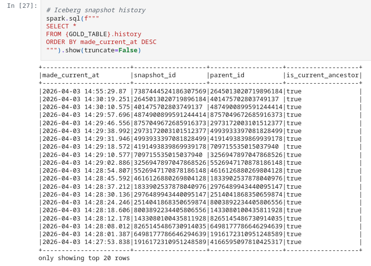
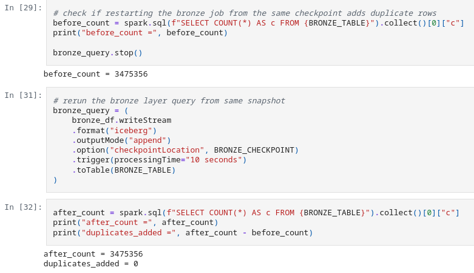

# Project 2: Streaming Lakehouse Pipeline

**Group J**

---

## 1. Medallion layer schemas

### Bronze

```
CREATE TABLE lakehouse.taxi.bronze_trips (
    kafka_key           STRING,
    raw_json            STRING,
    topic               STRING,
    partition           INT,
    offset              BIGINT,
    kafka_timestamp     TIMESTAMP,
    bronze_ingested_at  TIMESTAMP
)
USING iceberg
```

The bronze table stores every Kafka event exactly as received, with no parsing or transformation. raw_json contains the full taxi trip record as a JSON string. The Kafka metadata columns (topic, partition, offset, kafka_timestamp) are preserved for traceability and replay. bronze_ingested_at records when the row landed in the lakehouse. No cleaning or filtering is applied. The purpose of bronze is an append-only audit log of the raw stream.

### Silver

```
CREATE TABLE lakehouse.taxi.silver_trips (
    trip_id              STRING,
    VendorID             INT,
    pickup_ts            TIMESTAMP,
    dropoff_ts           TIMESTAMP,
    pickup_hour          INT,
    is_peak_hour         BOOLEAN,
    passenger_count      INT,
    trip_distance        DOUBLE,
    PULocationID         INT,
    pickup_zone          STRING,
    pickup_borough       STRING,
    DOLocationID         INT,
    dropoff_zone         STRING,
    dropoff_borough      STRING,
    fare_amount          DOUBLE,
    tip_amount           DOUBLE,
    total_amount         DOUBLE,
    payment_type         INT,
    congestion_surcharge DOUBLE,
    silver_ingested_at   TIMESTAMP,
    raw_json             STRING
)
USING iceberg
PARTITIONED BY (days(pickup_ts))
```

The silver table parses and cleans the raw JSON from bronze. Timestamps are cast from strings to proper TIMESTAMP columns (pickup_ts, dropoff_ts), numeric fields are cast to their correct types, and passenger_count is narrowed from DOUBLE to INT. A SHA-256 trip_id is derived from the combination of key trip fields and used with dropDuplicates to deduplicate the stream. pickup_hour and is_peak_hour are derived columns added for downstream aggregation. The table is enriched with pickup_zone, pickup_borough, dropoff_zone, and dropoff_borough from a zone lookup table join. Invalid rows are filtered out (null timestamps, negative fares/distances, dropoff before pickup). The table is partitioned by day of pickup_ts to optimize time-range queries. raw_json is retained for auditability.

### Gold

```
CREATE TABLE lakehouse.taxi.gold_peak_hour_trips (
    pickup_zone         STRING,
    pickup_hour         INT,
    peak_trip_count     BIGINT,
    non_peak_trip_count BIGINT
)
USING iceberg
```

The gold table aggregates silver trips by pickup_zone and pickup_hour, counting peak-hour trips (7–9am, 4–7pm) and non-peak trips separately. Updates are applied via MERGE INTO in a foreachBatch function, so restarting the pipeline overwrites existing counts rather than appending duplicates. The table is intentionally left unpartitioned. At most 260 zones x 24 hours yields 6,240 rows, and at 56MB a full scan completes near-instantly. Partitioning would introduce small-file overhead and extra metadata without providing any meaningful pruning benefit at this scale.

## 2. Cleaning rules and enrichment

### Cleaning rules

- Null timestamps — rows where `pickup_ts` or `dropoff_ts` is null are dropped. A trip with no time information is unusable for any time-based analysis.
- Null location IDs — rows where `PULocationID` or `DOLocationID` is null are dropped. Without locations the zone enrichment join is meaningless.
- Negative fares/distances — rows where `fare_amount`, `tip_amount`, `total_amount`, or `trip_distance` is negative are dropped. These are data entry errors with no valid business interpretation.
- Dropoff before pickup — rows where `dropoff_ts` < `pickup_ts` are dropped. A trip that ends before it starts is physically impossible.
- Deduplication — a SHA-256 `trip_id` is derived from `VendorID`, `pickup_ts`, `dropoff_ts`, `PULocationID`, `DOLocationID`, `trip_distance`, `fare_amount`, `tip_amount`, and `total_amount`. `dropDuplicates(["trip_id"])` removes duplicate events within each micro-batch.

### Enrichment

The silver table is joined with a static `taxi_zone_lookup` parquet file on `PULocationID` and `DOLocationID` to add `pickup_zone`, `pickup_borough`, `dropoff_zone`, and `dropoff_borough`. This makes the data self-describing without requiring a lookup at query time.

## 3. Streaming configuration

Checkpoint paths:
- Bronze: /tmp/checkpoints/project2/bronze_trips
- Silver: /tmp/checkpoints/project2/silver_trips
- Gold: /tmp/checkpoints/project2/gold_peak_hour_trips

Each checkpoint stores Kafka offset progress and micro-batch state, ensuring that on restart the stream resumes from where it left off without reprocessing already-committed offsets.

Trigger interval: 10 seconds for bronze and silver (processingTime="10 seconds"). This balances latency against the overhead of committing small Iceberg snapshots too frequently. The gold query uses the default micro-batch trigger since it runs as a foreachBatch aggregation driven by the silver stream.

Output modes:
- Bronze and silver use append. Each micro-batch adds new rows only, which is correct for an immutable event log
- Gold uses update. Only rows that changed in the current batch are output, which is necessary for the MERGE INTO upsert pattern

Watermark: Silver applies a 45-day watermark on pickup_ts. This tells Spark how long to wait for late-arriving events before closing a time window and releasing state, preventing unbounded state growth from dropDuplicates.

## 4. Gold table partitioning strategy

The gold table is intentionally left unpartitioned. At most 265 zones x 24 hours yields 6,360 rows, making full scans near-instant and partitioning overhead unjustified. The typical query pattern - aggregating across all zones for a given hour or vice versa - would touch most partitions anyway. Pruning provides no benefit at this scale. If the table were extended to track counts per day, partitioning by a date bucket would become worthwhile, but at the current scope it is unnecessary overhead.

The snapshot history of the gold table shows each micro-batch commit as a separate Iceberg snapshot, with a unique `snapshot_id`, `made_current_at` timestamp, and `is_current_ancestor` flag indicating the active lineage.



## 5. Restart proof

The bronze query was stopped after ingesting an initial batch of rows, then restarted from the same checkpoint. The row count before and after restart is identical, confirming that no duplicate rows were added.



## 6. Custom scenario

The custom scenario required adding a peak-hour flag to the silver layer and building a gold aggregation table split by peak vs non-peak trips. `is_peak_hour` is derived in the silver layer as `true` when the pickup hour falls between 7–9 or 16–19 inclusive. The gold table groups trips by `pickup_zone` and `pickup_hour`, counting peak and non-peak trips separately via a `MERGE INTO` upsert. The peak hour share across all trips is 38.63% .

## 7. How to run

```bash
# Step 1: Start infrastructure
docker compose up -d

# Step 2: Create the Kafka topic
docker exec kafka sh -c "/opt/kafka/bin/kafka-topics.sh --bootstrap-server localhost:9092 --create --topic taxi-trips --partitions 3 --replication-factor 1"

# Step 3: Start the producer
docker exec project2_jupyter python /home/jovyan/project/produce.py --loop

# Step 4: Run the playbook
# Run the cells in Project-2.ipynb
```

Values for env file:
```
MINIO_ROOT_USER=admin
MINIO_ROOT_PASSWORD=changeme
JUPYTER_TOKEN=changeme
```
